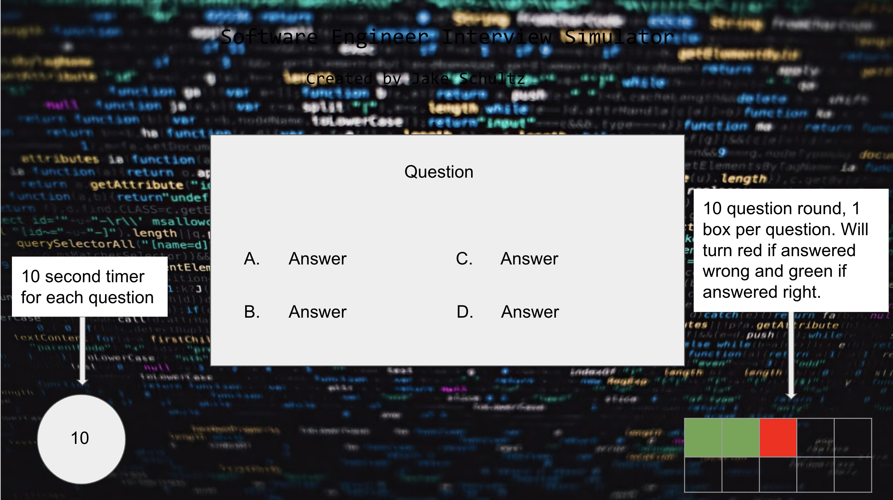

# Software Engineer Interview Simulator

https://jakeschultz89.github.io/Software-Engineer-Interview-Simulator/

# HOW TO PLAY

Congratulations, you have been selected for an interview at the hottest tech company in your area! Before offering you a fulltime position, you will need to complete an interview. The interview consists of ten questions relating to HTML, CSS and JavaScript. 

Depending on how well you perform, you may be offered the job! 

1) Begin the game by clicking "Start the Interview".
2) You will see the first question and the timer will start. For each question you will get a new ten second timer. Answer the question before the timer runs out or it counts as an incorrect response.
3) Score 0 - 4 points and you will be denied the job. Score 5 - 7 points and you will be offerer the job. Score 8 - 10 points and you will be offered the job AND a higher salary!

## Start Up Screen:
Images of the start up screen go here 

# HOW TO INSTALL

## Example
1. *`Fork`* and *`Clone`* this respository to your local machine
2. Open `index.html` in your browser to play or 
3. Open the directory in your text editor of choice to view or edit the code

Other install instructions will go here


# HOW IT WORKS
How the game works will go here
Code snippets go here


# FUTURE CONSIDERATIONS

Future considerations or stretch goals go here.


# PROCESS WORK

## Initial Wireframes:

# Homescreen


# Question Screen Example


# Result Screen Example


# Original Array Info
```let questions = [
    {
    question: "How can you make a numbered list?",
    choiceA: "<ol>",
    choiceB: "<ul>",
    choice: "<list>",
    correct: "A",
    },

    {
    question: "What is the correct HTML for making a text input field?",
    choiceA: "<textinput type='text'>",
    choiceB: "<input type='textfield'>",
    choiceC: "<input type='text'>",
    correct: "C",
    },

    {
    question: "Where in an HTML document is the correct place to refer to an external style sheet?",
    choiceA: "In the <head> section",
    choiceB: "In the <body> section",
    choiceC: "At the end of the document",
    correct: "A",
    },

    {
    question: "How do you select an element with id 'demo'?",
    choiceA: "#demo",
    choiceB: "demo",
    choiceC: ".demo",
    correct: "A",
    },

    {
    question: "How do you select elements with class name 'test'?",
    choiceA: "#test",
    choiceB: "*test",
    choiceC: ".test",
    correct: "C",
    },

    {
    question: "How do you make the text bold?",
    choiceA: "font:bold;",
    choiceB: "font-weight:bold;",
    choiceC: "style:bold;",
    correct: "B",
    },

    {
    question: "How does a FOR loop start?",
    choiceA: "while i = 1 to 10",
    choiceB: "while (i <= 10)",
    choiceC: "while (i <= 10; i++)",
    correct: "B",
    },

    {
    question: "How do you call a function named 'myFunction'?",
    choiceA: "myFunction()",
    choiceB: "call myFunction()",
    choiceC: "call function myFunction()",
    correct: "A",
    },

    {
    question: "How do you create a function in JavaScript?",
    choiceA: "function = exampleFunction()",
    choiceB: "function:exampleFunction()",
    choiceC: "function exampleFunction() ",
    correct: "C",
    },

    { 
    question: "What is the correct way to write a JavaScript array?",
    choiceA: "let colors = 'red', 'green', 'blue'",
    choiceB: "let colors = (1:'red', 2:'green', 3:'blue')",        
    choiceC: "let colors = ['red', 'green', 'blue']",
    correct: "C",
    },
]
```
# Updated Array Info to allow for Randomization
```const questions = [
    {
    question: "How can you make a numbered list?",
    answers: [
        {text: "<ol>", correct: true},
        {text: "<ul>", correct: false},
        {text: "<list>", correct: false},
        {text: "<nl>", correct: false}
    ]
    },

    {
    question: "What is the correct HTML for making a text input field?",
    answers: [
        {text: "<textinput type='text'>", correct: false},
        {text: "<input type='textfield'>", correct: false},
        {text: "<textfield>", correct: false},
        {text: "<input type='text'>", correct: true}
    ]
    },

    {
    question: "Where in an HTML document is the correct place to refer to an external style sheet?",
    answers: [
        {text: "In the <body> section", correct: false},
        {text: "In the <head> section", correct: true},
        {text: "At the end of the document", correct: false},
        {text: "It automatically connects", correct: false}
    ]
    },

    {
    question: "How do you select an element with id 'demo'?",
    answers: [
        {text: "#demo", correct: true},
        {text: "demo", correct: false},
        {text: ".demo", correct: false},
        {text: "id-demo", correct: false}
    ]
    },

    {
    question: "How do you select elements with class name 'test'?",
    answers: [
        {text: "#test", correct: false},
        {text: "*test", correct: false},
        {text: ".test", correct: true},
        {text: "test {}", correct: false}
    ]
    },

    {
    question: "How do you make the text bold?",
    answers: [
        {text: "font:bold;", correct: false},
        {text: "font-style: thicc bois;", correct: false},
        {text: "style:bold;", correct: false},
        {text: "font-weight:bold;", correct: true}
    ]
    },

    {
    question: "How does a FOR loop start?",
    answers: [
        {text: "while i = 1 to 10", correct: false},
        {text: "while (i <= 10)", correct: true},
        {text: "while (i <= 10; i++)", correct: false},
        {text: "while i = (i++)", correct: false}
    ]
    },

    {
    question: "How do you call a function named 'myFunction'?",
    answers: [
        {text: "myFunction()", correct: true},
        {text: "call myFunction()", correct: false},
        {text: "call function myFunction()", correct: false},
        {text: "Hey Siri, call myFunction", correct: false}
    ]
    },

    {
    question: "How do you create a function in JavaScript?",
    answers: [
        {text: "function = exampleFunction()", correct: false},
        {text: "function:exampleFunction()", correct: false},
        {text: "function exampleFunction()", correct: true},
        {text: "function.create", correct: false}
    ]
    },

    { 
    question: "What is the correct way to write a JavaScript array?",
    answers: [
        {text: "let colors = 'red', 'green', 'blue'", correct: false},
        {text: "let colors = (1:'red', 2:'green', 3:'blue')", correct: false},  
        {text: "let colors = ['red', 'green', 'blue']", correct: true},
        {text: "let array colors = 'red', 'green', blue'", correct: false}
    ]
    },
]
```

## Scratch Work:

Scratch Work goes here
