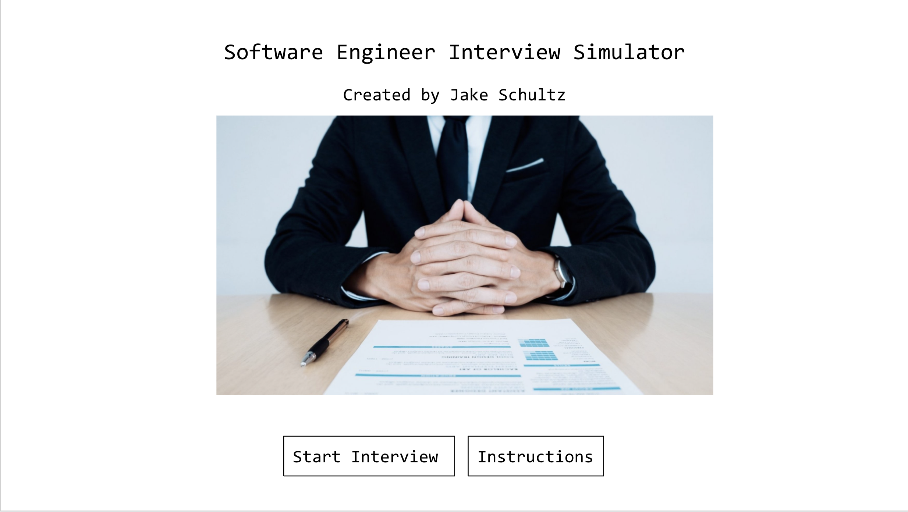

# Software Engineer Interview Simulator

https://jakeschultz89.github.io/Software-Engineer-Interview-Simulator/

# Resources Used

https://www.youtube.com/watch?v=f4fB9Xg2JEY


# HOW TO PLAY

Congratulations, you have been selected for an interview at the hottest tech company in your area! Before offering you a fulltime position, you will need to complete an interview. The interview consists of ten questions relating to HTML, CSS and JavaScript. 

Depending on how well you perform, you may be offered the job! 

1) Begin the game by clicking "Start the Interview".
2) You will see the first question and the timer will start. For each question you will get a new ten second timer. Answer the question before the timer runs out or it counts as an incorrect response.
3) Score 0 - 40,000 points and you will be denied the job. Score 50,000 - 70,000 points and you will be offerer the job. Score 80,000 - 100,000 points and you will be offered the job AND a higher salary!

## Start Up Screen:


# HOW TO INSTALL

1. *`Fork`* and *`Clone`* this respository to your local machine
2. Open `index.html` in your browser to play or 
3. Open the directory in your text editor of choice to view or edit the code

OR

Click the link below to play directly in your browser:

https://jakeschultz89.github.io/Software-Engineer-Interview-Simulator/

# HOW IT WORKS
```javascript
const question = document.querySelector("#question"); //querySelector makes it so I can target id or class.
const choices = Array.from(document.querySelectorAll(".choice-text")); //this targets the text of the answer choices.
const progressText = document.querySelector("#progressText"); //this targets the text that will show question 1 of 10, 2 of 10, etc.
const scoreText = document.querySelector("#score"); // scoreText will be used in the HUD and end page.
// const finalScore = document.querySelector('#finalScore'); //final score to be displayed on end.html

let currentQuestion = {}; //makes currentQuestion an empty opject that can be manipulated later.
let acceptingAnswers = true; 
let score = 0; //establishing score as a number
let questionCounter = 0; //question counter will be a number
let availableQuestions = []; //the available questions are in an array

let questions = [
    {
      question: "How can you make a numbered list?",
      choice1: "<ol>",
      choice2: "<ul>",
      choice3: "<list>",
      choice4: "<nl>",
      answer: 1,
    },
  
    {
      question: "What is the correct HTML for making a text input field?",
      choice1: "<textinput type='text'>",
      choice2: "<input type='textfield'>",
      choice3: "<input type='text'>",
      choice4: "<textfield>",
      answer: 3,
    },
  
    {
      question:
        "Where in an HTML document is the correct place to refer to an external style sheet?",
      choice1: "In the <head> section",
      choice2: "In the <body> section",
      choice3: "At the end of the document",
      choice4: "It automatically connects",
      answer: 1,
    },
  
    {
      question: "How do you select an element with id 'demo'?",
      choice1: "id-demo",
      choice2: "demo",
      choice3: ".demo",
      choice4: "#demo",
      answer: 4,
    },
  
    {
      question: "How do you select elements with class name 'test'?",
      choice1: "#test",
      choice2: "*test",
      choice3: ".test",
      choice4: "test {}",
      answer: 3,
    },
  
    {
      question: "How do you make the text bold?",
      choice1: "font-style: thicc bois;",
      choice2: "font-weight:bold;",
      choice3: "style:bold;",
      choice4: "font:bold;",
      answer: 2,
    },
  
    {
      question: "How does a FOR loop start?",
      choice1: "while i = 1 to 10",
      choice2: "while (i <= 10)",
      choice3: "while (i <= 10; i++)",
      choice4: "while i = (i++)",
      answer: 2,
    },
  
    {
      question: "How do you call a function named 'myFunction'?",
      choice1: "myFunction()",
      choice2: "call myFunction()",
      choice3: "call function myFunction()",
      choice4: "Hey Siri, call myFunction",
      answer: 1,
    },
  
    {
      question: "How do you create a function in JavaScript?",
      choice1: "function = exampleFunction()",
      choice2: "function:exampleFunction()",
      choice3: "function exampleFunction() ",
      choice4: "function.create",
      answer: 3,
    },
  
    {
      question: "What is the correct way to write a JavaScript array?",
      choice1: "let colors = 'red', 'green', 'blue'",
      choice2: "let colors = (1:'red', 2:'green', 3:'blue')",
      choice3: "let colors = ['red', 'green', 'blue']",
      choice4: "let array colors = 'red', 'green', blue'",
      answer: 3,
    }
  ];

  const SCORE_POINTS = 10000; //each question correct will award the player with 10,000 points
  const MAX_QUESTIONS = 10; //the game will run for a total of 10 questions

  startGame = () => { // function for starting the game
      questionCounter = 0; //counter will start at 0(empty)
      score = 0; //score will always start back at 0 points
      availableQuestions = [...questions]; // spread operator - the game will pull from the array of questions
      getNewQuestion(); //present a question
  }

  getNewQuestion = () => { //function for getting the questions
      if(availableQuestions.length === 0 || questionCounter > MAX_QUESTIONS) { //if there are no more questions
          localStorage.setItem("mostRecentScore", score); //the score is saved to local storage

          return window.location.assign('end.html'); //score is displayed on end.html
      }
      questionCounter++ // as each question is asked
      progressText.innerText = `Question ${questionCounter} of ${MAX_QUESTIONS} `; //shows a counter for the player to know which question they are currently on.

      const questionsIndex = Math.floor(Math.random() * availableQuestions.length); //this makes it so that the questions are asked in random order each time.
      currentQuestion = availableQuestions[questionsIndex]; // keeps track of which question we are on
      question.innerText = currentQuestion.question; //this tells the game which question to show

      choices.forEach(choice => { //function for showing the array choices
          const number = choice.dataset["number"]; //this is what labels the answer in the array as the correct asnwer.
          choice.innerText = currentQuestion["choice" + number];
      })

      availableQuestions.splice(questionsIndex, 1); //this adds/removes the questions from the array to the container.

      acceptingAnswers = true; //?
  }

  choices.forEach(choice => { //function for checking answers or choices.
      choice.addEventListener('click', e => { //this function happens on a click.
          if(!acceptingAnswers) return //if the click is not on an answer, return, wait for next click.

          acceptingAnswers = false
          const selectedChoice = e.target
          const selectedAnswer = selectedChoice.dataset["number"]  //the right choice is connected to the question by the "number".

          let classToApply = selectedAnswer == currentQuestion.answer ? "correct" : "incorrect" //this allows the game to decipher if the answer was right or wrong.

          if(classToApply === "correct") { // if the answer is correct
              incrementScore(SCORE_POINTS) //add incremental points
          }

          setTimeout(() => { //this times out so it prompts the new question
              getNewQuestion()

          }, 10) //milliseconds before screen changes.
      })
  })

  incrementScore = num => { //function to increase score
      score +=num //score + increcement number (10000)
      scoreText.innerText = score 
  }

  startGame()
  ```


# FUTURE CONSIDERATIONS

Stretch goals for this project include:

 * Getting a 10 second timer to run for each question.

 * Having the end page show a different image depending on what your score was.

# PROCESS WORK

## Initial Wireframes:

### Start Screen


### Question Screen Example


### Result Screen Example
